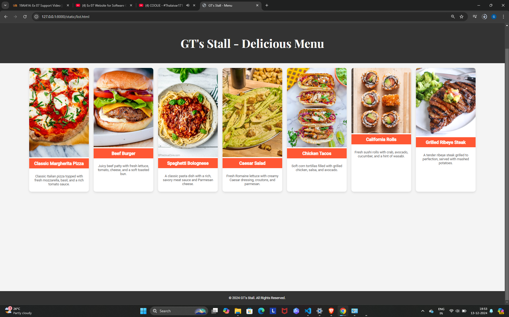
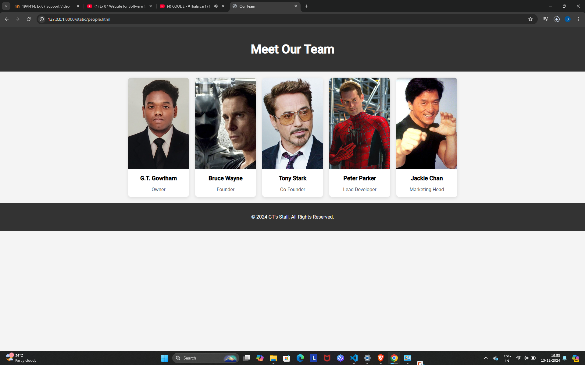
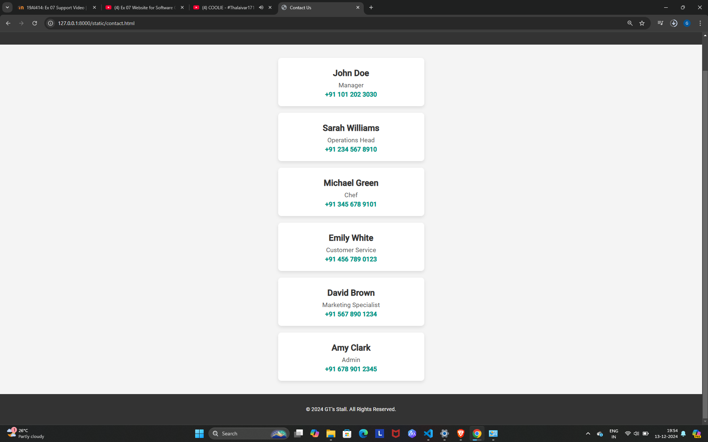

# Ex.07 Restaurant Website
## Date:13-12-2024

## AIM:
To develop a static Restaurant website to display the food items and services provided by them.

## DESIGN STEPS:

### Step 1:
Requirement collection.

### Step 2:
Creating the layout using HTML and CSS.

### Step 3:
Updating the sample content.

### Step 4:
Choose the appropriate style and color scheme.

### Step 5:
Validate the layout in various browsers.

### Step 6:
Validate the HTML code.

### Step 7:
Publish the website in the given URL.

## PROGRAM:
```
home.html
<!DOCTYPE html>
<html lang="en">
<head>
    <meta charset="UTF-8">
    <meta name="viewport" content="width=device-width, initial-scale=1.0">
    <title>GT'S STALL</title>
    <link href="https://fonts.googleapis.com/css2?family=Playfair+Display:wght@700&family=Roboto:wght@400;500&display=swap" rel="stylesheet">
    <style>
        /* General body styling */
        body {
            margin: 0;
            padding: 0;
            font-family: 'Roboto', sans-serif;
            background: url('https://assets.talentronic.com/photos/employers/235247/530578_l.jpg') no-repeat center center fixed;
            background-size: cover;
            color: #fff;
            height: 100vh;
        }

        /* Top Right Menu Buttons */
        #menu-list-buttons {
            position: absolute;
            top: 20px;
            right: 20px;
            display: flex;
            flex-direction: row;
            gap: 20px;
        }

        #menu-list-buttons a {
            font-size: 16px;
            text-decoration: none;
            color: #fff;
            font-weight: bold;
            text-transform: uppercase;
            padding: 10px 15px;
            border: 2px solid #fff;
            border-radius: 5px;
            transition: all 0.3s ease;
            text-shadow: 1px 1px 3px rgba(0, 0, 0, 0.4);
        }

        #menu-list-buttons a:hover {
            background-color: #1abc9c;
            color: white;
            border-color: #1abc9c;
        }

        /* Center logo styling */
        .logo-container {
            text-align: center;
            position: absolute;
            top: 50%;
            left: 50%;
            transform: translate(-50%, -50%);
            animation: fadeIn 2s ease-in-out;
        }

        .logo-container img {
            max-width: 300px;
            border: 5px solid rgba(255, 255, 255, 0.3);
            border-radius: 50%;
            box-shadow: 0 10px 20px rgba(0, 0, 0, 0.5);
            transition: transform 0.3s ease-in-out;
        }

        .logo-container img:hover {
            transform: scale(1.1);
        }

        .logo-container h1 {
            font-family: 'Playfair Display', serif;
            font-size: 36px;
            margin-top: 20px;
            color: #ffffff;
            text-shadow: 2px 2px 8px rgba(0, 0, 0, 0.7);
        }

        /* Animation for the logo */
        @keyframes fadeIn {
            0% {
                opacity: 0;
                transform: translateY(-30px);
            }
            100% {
                opacity: 1;
                transform: translateY(0);
            }
        }

        footer {
            position: absolute;
            bottom: 10px;
            width: 100%;
            text-align: center;
            color: #ffffff;
            font-size: 14px;
        }
    </style>
</head>
<body>
    <!-- Top Right Menu Buttons -->
    <div id="menu-list-buttons">
        <a href="list.html">List</a>
        <a href="people.html">People</a>
        <a href="contact.html">Contact</a>
    </div>

    <!-- Main content -->
    <div class="logo-container">
        
        <h1>Welcome to GT's Stall</h1>
    </div>

    <footer>
        <p>&copy; 2024 GT'S STALL. All Rights Reserved.</p>
    </footer>
</body>
</html>

style.css
html, body { 
    margin: 0;
    padding: 0;
    height: 100%;
  }
  
  body {
    font-family: 'Roboto', sans-serif;
  }
  
  #menu-list-buttons {
    position: absolute;
    top: 10px;
    right: 20px;
    display: flex;
    gap: 15px;
  }
  
  #menu-list-buttons a {
    color: #fff;
    text-decoration: none;
    font-weight: bold;
    font-size: 18px;
  }
  
  header {
    text-align: center;
    margin-top: 100px;
  }
  
  header h1 {
    font-family: 'Playfair Display', serif;
    font-size: 3rem;
  }
  
  #menu {
    padding: 20px;
    background-color: rgba(0, 0, 0, 0.6);
    color: white;
    margin-top: 30px;
    text-align: center;
  }
  
  #menu-list {
    max-height: 200px; /* Set the height for the scrollable area */
    overflow-y: auto;  /* Enables vertical scrolling when content exceeds max-height */
    padding: 10px;
    background-color: rgba(255, 255, 255, 0.8);
    border-radius: 10px;
    box-shadow: 0px 4px 6px rgba(0, 0, 0, 0.2);
  }
  
  #menu-list a.cta-button {
    background-color: #FB3569;
    color: white;
    padding: 10px 20px;
    border-radius: 5px;
    text-decoration: none;
  }
  
  #menu-list a.cta-button:hover {
    background-color: #e63258;
  }
  
  ul {
    padding: 0;
    list-style-type: none;
  }
  
  ul li {
    display: inline-block;
    margin: 10px;
  }
  
  footer {
    text-align: center;
    padding: 20px;
    background-color: #270f34;
    color: #fff;
  }
  
  footer p {
    margin: 0;
    font-size: 14px;
  }
  
list.html
<!DOCTYPE html>
<html lang="en">
<head>
    <meta charset="UTF-8">
    <meta name="viewport" content="width=device-width, initial-scale=1.0">
    <title>GT's Stall - Menu</title>
    <link href="https://fonts.googleapis.com/css2?family=Playfair+Display:wght@700&family=Roboto:wght@400;500&display=swap" rel="stylesheet">
    <link rel="stylesheet" href="style.css">
    <style>
        body {
            font-family: 'Roboto', sans-serif;
            background-color: #f4f4f4;
            margin: 0;
            padding: 0;
        }

        header {
            text-align: center;
            padding: 20px;
            background-color: #333;
            color: white;
        }

        .menu-container {
            display: flex;
            justify-content: center;
            flex-wrap: wrap;
            gap: 20px;
            padding: 20px;
        }

        .menu-item {
            background-color: white;
            border-radius: 10px;
            overflow: hidden;
            width: 250px;
            box-shadow: 0 4px 8px rgba(0, 0, 0, 0.1);
        }

        .menu-item img {
            width: 100%;
            height: auto;
        }

        .menu-item h3 {
            text-align: center;
            padding: 10px;
            background-color: #ff5733;
            color: white;
            margin: 0;
        }

        .menu-item p {
            padding: 10px;
            text-align: center;
            font-size: 14px;
            color: #555;
        }

        footer {
            text-align: center;
            padding: 20px;
            background-color: #333;
            color: white;
            position: fixed;
            width: 100%;
            bottom: 0;
        }
    </style>
</head>
<body>

    <header>
        <h1>GT's Stall - Delicious Menu</h1>
    </header>

    <div class="menu-container">
        <!-- Classic Margherita Pizza -->
        <div class="menu-item">
            
            <h3>Classic Margherita Pizza</h3>
            <p>Classic Italian pizza topped with fresh mozzarella, basil, and a rich tomato sauce.</p>
        </div>

        <!-- Beef Burger -->
        <div class="menu-item">
            
            <h3>Beef Burger</h3>
            <p>Juicy beef patty with fresh lettuce, tomato, cheese, and a soft toasted bun.</p>
        </div>

        <!-- Spaghetti Bolognese -->
        <div class="menu-item">
            
            <h3>Spaghetti Bolognese</h3>
            <p>A classic pasta dish with a rich, savory meat sauce and Parmesan cheese.</p>
        </div>

        <!-- Caesar Salad -->
        <div class="menu-item">
            
            <h3>Caesar Salad</h3>
            <p>Fresh Romaine lettuce with creamy Caesar dressing, croutons, and parmesan.</p>
        </div>

        <!-- Chicken Tacos -->
        <div class="menu-item">
            
            <h3>Chicken Tacos</h3>
            <p>Soft corn tortillas filled with grilled chicken, salsa, and avocado.</p>
        </div>

        <!-- California Rolls -->
        <div class="menu-item">
            
            <h3>California Rolls</h3>
            <p>Fresh sushi rolls with crab, avocado, cucumber, and a hint of wasabi.</p>
        </div>

        <!-- Grilled Ribeye Steak -->
        <div class="menu-item">
            
            <h3>Grilled Ribeye Steak</h3>
            <p>A tender ribeye steak grilled to perfection, served with mashed potatoes.</p>
        </div>
    </div>

    <footer>
        <p>&copy; 2024 GT's Stall. All Rights Reserved.</p>
    </footer>

</body>
</html>

list.css
/* Basic reset */
html, body {
    margin: 0;
    padding: 0;
    font-family: 'Roboto', sans-serif;
}

/* Body styling */
body {
    background-color: #f8f8f8;
    color: #333;
}

/* Header */
header {
    text-align: center;
    margin-top: 50px;
}

header h1 {
    font-size: 3rem;
    font-weight: bold;
    color: #333;
}

/* Menu section */
#menu {
    display: flex;
    justify-content: center;
    align-items: center;
    flex-wrap: wrap;
    margin: 50px 0;
}

.menu-container {
    display: flex;
    justify-content: space-around;
    flex-wrap: wrap;
    max-width: 1200px;
    gap: 30px;
}

/* Menu item styles */
.menu-item {
    text-align: center;
    width: 250px;
    margin: 20px;
    background-color: #fff;
    padding: 20px;
    border-radius: 10px;
    box-shadow: 0 4px 10px rgba(0, 0, 0, 0.1);
}

.food-image {
    width: 100%;
    height: auto;
    border-radius: 8px;
}

/* Menu item title and description */
h3 {
    font-size: 1.4rem;
    font-weight: bold;
    margin-top: 10px;
    color: #333;
}

p {
    font-size: 1rem;
    color: #555;
}

/* Footer */
footer {
    text-align: center;
    padding: 20px;
    background-color: #333;
    color: white;
}

people.html
<!DOCTYPE html>
<html lang="en">
<head>
    <meta charset="UTF-8">
    <meta name="viewport" content="width=device-width, initial-scale=1.0">
    <title>Our Team</title>
    <link href="https://fonts.googleapis.com/css2?family=Playfair+Display:wght@700&family=Roboto:wght@400;500&display=swap" rel="stylesheet">
    <style>
        body {
            font-family: 'Roboto', sans-serif;
            background-color: #f4f4f4;
            margin: 0;
            padding: 0;
        }
        header {
            text-align: center;
            padding: 50px;
            background-color: #333;
            color: white;
        }
        header h1 {
            font-size: 2.5em;
            margin: 0;
        }
        .container {
            display: flex;
            justify-content: center;
            flex-wrap: wrap;
            gap: 20px;
            padding: 20px;
        }
        .team-member {
            text-align: center;
            background-color: white;
            border-radius: 10px;
            overflow: hidden;
            box-shadow: 0 4px 10px rgba(0, 0, 0, 0.1);
            width: 200px;
        }
        .team-member img {
            width: 100%;
            height: 300px;
            object-fit: cover;
        }
        .team-member h3 {
            margin: 15px 0 10px;
            font-size: 1.2em;
            font-weight: 600;
        }
        .team-member p {
            font-size: 1em;
            color: #555;
            margin-bottom: 15px;
        }
        footer {
            text-align: center;
            padding: 20px;
            background-color: #333;
            color: white;
        }
    </style>
</head>
<body>

<header>
    <h1>Meet Our Team</h1>
</header>

<div class="container">
    <div class="team-member">
        
        <h3>G.T. Gowtham</h3>
        <p>Owner</p>
    </div>
    <div class="team-member">
        
        <h3>Bruce Wayne</h3>
        <p>Founder</p>
    </div>
    <div class="team-member">
        
        <h3>Tony Stark</h3>
        <p>Co-Founder</p>
    </div>
    <div class="team-member">
        
        <h3>Peter Parker</h3>
        <p>Lead Developer</p>
    </div>
    <div class="team-member">
        
        <h3>Jackie Chan</h3>
        <p>Marketing Head</p>
    </div>
</div>

<footer>
    <p>&copy; 2024 GT's Stall. All Rights Reserved.</p>
</footer>

</body>
</html>

people.css
/* Basic reset */
html, body {
    margin: 0;
    padding: 0;
    height: 100%;
    width: 100%;
    font-family: 'Roboto', sans-serif;
}

/* Body and background */
body {
    background-color: #f8f8f8;
    color: #333;
}

/* Header styles */
header {
    text-align: center;
    margin-top: 50px;
}

header h1 {
    font-size: 3rem;
    font-weight: bold;
    color: #333;
}

/* Team section */
#team {
    display: flex;
    justify-content: center;
    align-items: center;
    flex-wrap: wrap;
    margin: 50px 0;
}

.team-container {
    display: flex;
    justify-content: space-around;
    flex-wrap: wrap;
    max-width: 1200px;
    gap: 40px;
}

/* Each team member */
.team-member {
    text-align: center;
}

.photo-holder {
    width: 150px;
    height: 150px;
    margin: 10px;
    border-radius: 50%; /* Circle shape */
    overflow: hidden;
    display: flex;
    justify-content: center;
    align-items: center;
    box-shadow: 0 4px 10px rgba(0, 0, 0, 0.1); /* Add slight shadow */
}

.circle-photo {
    width: 100%;
    height: 100%;
    object-fit: cover;
}

/* Name and Role styling */
.name {
    margin-top: 10px;
    font-size: 1.2rem;
    font-weight: bold;
    color: #333;
}

.role {
    font-size: 1rem;
    color: #777;
}

/* Footer */
footer {
    text-align: center;
    padding: 20px;
    background-color: #333;
    color: white;
}

contact.html
<!DOCTYPE html>
<html lang="en">
<head>
    <meta charset="UTF-8">
    <meta name="viewport" content="width=device-width, initial-scale=1.0">
    <title>Contact Us</title>
    <link href="https://fonts.googleapis.com/css2?family=Playfair+Display:wght@700&family=Roboto:wght@400;500&display=swap" rel="stylesheet">
    <style>
        body {
            font-family: 'Roboto', sans-serif;
            background-color: #f4f4f4;
            margin: 0;
            padding: 0;
        }
        header {
            text-align: center;
            padding: 50px;
            background-color: #333;
            color: white;
        }
        header h1 {
            font-size: 2.5em;
            margin: 0;
        }
        .container {
            display: flex;
            flex-direction: column;
            align-items: center;
            gap: 20px;
            padding: 40px;
        }
        .contact-card {
            background-color: white;
            width: 100%;
            max-width: 400px;
            border-radius: 10px;
            padding: 20px;
            box-shadow: 0 4px 10px rgba(0, 0, 0, 0.1);
            text-align: center;
        }
        .contact-card h3 {
            margin: 10px 0;
            font-size: 1.6em;
            font-weight: 600;
            color: #333;
        }
        .contact-card p {
            font-size: 1.2em;
            color: #555;
            margin: 5px 0;
        }
        .contact-card .contact-number {
            font-weight: bold;
            color: #009688;
        }
        footer {
            text-align: center;
            padding: 20px;
            background-color: #333;
            color: white;
        }
    </style>
</head>
<body>

<header>
    <h1>Contact Our Team</h1>
</header>

<div class="container">
    <div class="contact-card">
        <h3>John Doe</h3>
        <p>Manager</p>
        <p class="contact-number">+91 101 202 3030</p>
    </div>

    <div class="contact-card">
        <h3>Sarah Williams</h3>
        <p>Operations Head</p>
        <p class="contact-number">+91 234 567 8910</p>
    </div>

    <div class="contact-card">
        <h3>Michael Green</h3>
        <p>Chef</p>
        <p class="contact-number">+91 345 678 9101</p>
    </div>

    <div class="contact-card">
        <h3>Emily White</h3>
        <p>Customer Service</p>
        <p class="contact-number">+91 456 789 0123</p>
    </div>

    <div class="contact-card">
        <h3>David Brown</h3>
        <p>Marketing Specialist</p>
        <p class="contact-number">+91 567 890 1234</p>
    </div>

    <div class="contact-card">
        <h3>Amy Clark</h3>
        <p>Admin</p>
        <p class="contact-number">+91 678 901 2345</p>
    </div>
</div>

<footer>
    <p>&copy; 2024 GT's Stall. All Rights Reserved.</p>
</footer>

</body>
</html>

contact.css
/* Basic reset */
html, body {
    margin: 0;
    padding: 0;
    height: 100%;
    width: 100%;
    font-family: 'Roboto', sans-serif;
}

/* Body and background */
body {
    background-color: #f8f8f8;
    color: #333;
}

/* Header styles */
header {
    text-align: center;
    margin-top: 50px;
}

header h1 {
    font-size: 3rem;
    font-weight: bold;
    color: #333;
}

/* Contact section */
#contact {
    display: flex;
    justify-content: center;
    align-items: center;
    flex-wrap: wrap;
    margin: 50px 0;
}

.contact-container {
    display: flex;
    justify-content: space-around;
    flex-wrap: wrap;
    max-width: 1200px;
    gap: 40px;
}

/* Each contact member */
.contact-member {
    text-align: center;
    width: 250px;
    margin: 20px;
}

.photo-holder {
    width: 150px;
    height: 150px;
    margin: 10px;
    border-radius: 50%; /* Circle shape */
    overflow: hidden;
    display: flex;
    justify-content: center;
    align-items: center;
    box-shadow: 0 4px 10px rgba(0, 0, 0, 0.1); /* Add slight shadow */
}

.circle-photo {
    width: 100%;
    height: 100%;
    object-fit: cover;
}

/* Name and Role styling */
h3 {
    margin-top: 10px;
    font-size: 1.4rem;
    font-weight: bold;
    color: #333;
}

p {
    font-size: 1rem;
    color: #555;
}

/* Footer */
footer {
    text-align: center;
    padding: 20px;
    background-color: #333;
    color: white;
}
```
## OUTPUT:




## RESULT:
The program for designing software company website using HTML and CSS is completed successfully.
